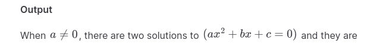

Một tiêu đề có độ dài như thế này các bạn có thể hình dung đến tiêu đề của một
[Light Novel][light-novel] -- tiêu đề thường hay dài để tóm tắt khái quát qua nội
dung của tác phẩm, nhằm thu hút người đọc bởi cái nhìn đầu tiên, trong vô vàn
tác phẩm khác. Nhưng rõ ràng là nó sẽ không có tác dụng lắm nếu như home page
của blog của bạn có phần trích đoạn ngay dưới tiêu đề :rofl:.

[light-novel]: https://anime.stackexchange.com/questions/48832/why-do-light-novels-and-manga-have-long-titles

<!-- more -->

Nhưng riêng với blog này, tiêu đề đã mô tả quá rõ ràng rồi, do đó mình sẽ không
dẫn dắt thêm nữa. Nói là một blog post, nhưng post này sẽ có hai nội dung:
mình tiếp tục viết blog, và thay đổi blog engine. Nhìn vào tiêu đề mà nói,
việc thay đổi blog engine sẽ là tâm điểm chính cho post này.

::: info Đính chính
Nói là đổi _blog engine_, tuy nhiên thứ mình đổi ở đây là đổi [_static site
generator_][static site generator].
:::

## Tại sao mình không sử dụng Jekyll nữa

Mình lựa chọn [Jekyll] là vì đó là lựa chọn _mặc định_ khi host blog trên
[Github page](https://pages.github.com/). Github page xử lý các tài nguyên
tĩnh, do đó sử dụng một [static site generator] là một lựa chọn hợp lý.
Sử dụng [static site generator] cũng giúp người viết blog nói riêng và
người quản lý nội dung nói chung không cần phải quan tâm đến việc quản lý
dữ liệu động. [Jekyll] còn được Github ủng hộ, do đó đây lúc nào cũng là
một trong những sự lựa chọn hàng đầu khi bắt đầu viết blog mà host trên
Github page. Cá nhân mình nghĩ rằng [Jekyll] vẫn là một sự lựa chọn
tôt khi mới bắt đầu.

[Jekyll] có đi kèm với một theme mặc định là [Mimima][Jekyll-minima]. Mình
cũng rất thích theme này với mô tả trong Github repo của nó:

> Minima is a one-size-fits-all Jekyll theme for writers.

Tức đây là một theme rất đơn giản, nhưng có thiết kế modern và vừa mắt. Câu
mô tả trên không sai một tí nào luôn!

Vậy khi mới mở blog, mình sử dụng Jekyll và tất nhiên cũng dùng minima luôn.
Tất nhiên cũng sửa sửa nhẹ. Do lúc mình cài, phiên bản Minima khi tạo blog
mới là 2.0, nên mình có bump nó lên 3.0 để dùng các tính năng mới hơn.

Tuy nhiên mình không chỉ mỗi tập chung vào phần nội dung. Mình là người rất chú
trọng hình thức. Vì đây là static site generator, mình quản lý toàn bộ nội dung
của blog, bao gồm cả theme, do đó mình hoàn toàn có thể thực hiện modding site
của mình. Do đó là mình đã thêm kha khá component cho trang blog, như là
theme-switcher, table of content, import file code từ ngoài, comment section,
... Từ bài viết cuối của mình là mình còn có những component đang viết dở, song
mình không tiếp tục mod nữa mà mình đi làm những thứ khác, bỏ quên chúng luôn.
Về những component đã thêm vào, mình còn document chúng lại. Các bạn có thể đọc
file [README.md][old-blog-readme] cũ tại đây để xem những component mình đã thêm
vào.


Đó là khoảng 1 năm về trước. Bây giờ khi nhìn lại, mình nhận ra rằng nếu mod
như vậy lại rất khổ sở. Mình không biết Ruby (ngôn ngữ mà [Jekyll] sử dụng)
để mod ở tầng đó (well thật ra là mình có thể học nhưng mình nhớ mình đọc
đâu đó mà Github page với Jekyll không chạy custom Ruby gì gì đó, nên mới
không tiếp tục). Việc mod do đó diễn ra ở phần Front-end, và mình mod luông
bằng ngôn ngữ template mà Jekyll sử dụng - [Liquid][Liquid-lang]. Liquid
có thể sử dụng như một ngôn ngữ lập trình hoàn chỉnh. Nó có biến, vòng
lặp và rẽ nhánh. Mình có thê include component bất kì vào blog post và layout
riêng của mình. Nhưng có những trở ngại nhất định khi dùng Liquid:

::: details Việc include nội dung bên ngoài.
Khi mình muốn include content ở ngoài, file đó cần nằm cùng thư mục `_posts` của
Jekyll mà không được nằm trong chỗ khác. Ngoài ra mình còn cần phải ignore các
file này khỏi site, những nội dung này lại cần nằm trong một thư mục khác có dầu
`_` ở trước tên. Nên là mình tống hết chúng nó vào một thư mục là
`_embed_contents`. Nó còn các chi tiết lẻ tẻ khác nữa, nhưng nói dến đây cũng có
thể thấy quản lý nội dung không rành mạch lắm.
:::

::: details Việc include file `script` và `style`.
Các component mình tạo ra chủ yếu là component Front-end, và chúng yêu cầu các
file `script` và `style`. Với giới hạn của Liquid, mình phải tự phát minh ra
include-guard y như trong C. Về triển khai bạn có thể tham khảo tạo file này
[file này][old-blog.custom-include-guard]. Chưa kể khi include `script` và
`style` như thế này là include vào giữa `body` chứ không phải là một chỗ cố
dịnh.
:::

<!-- maybe more ? -->

Và có nhiều chi tiết lặt vặt khác. Như vậy thật thời gian mình bỏ ra để mod
blog site của mình còn nhiều hơn cả thời gian viết blog. Đến đây mình mời nhận
ra rằng mình nên sử dụng tool khác thay vì Jekyll. Một Front-end framework thực
sự thay vì một ngôn ngữ template đơn thuần.

## Vậy mình đã chọn static site generator nào?

Nếu như bạn nhìn vào trang blog của mình và chưa biến nó giống cái tool nào,
thì mình xin giới thiệu chiếc static site generator [Vitepress]! Vitepress
đã đạt, thậm chí vượt qua tiêu chí mình mà mình chọn static site generator:

- Sử dụng [Vue][Vuejs] Front-end framework. Như mình đã đề cập ở trên, mình
    muốn sử dụng một framework để mod dễ dàng hơn. Thậm chí tool này còn được tạo
    ra chính bởi team tạo ra Vue, được sử dụng bởi team Vue để viết documentation.
    Nên đây là tool rất tín!

- Ngôn ngữ lập trình cho Front-end chính là `JavaScript` và `TypeScript`. Việc
    có `TypeScript` là một điểm cộng rất lớn. Mình đã tiếp xúc rất nhiều với
    `TypeScript` trong vòng một năm vừa qua, và quan điểm của mình là có typing lúc
    nào cũng tốt hơn. (btw mình tự tin nói rằng mình thông thạo `TypeScript`. Sẽ có
    blog về `TypeScript`. Soon :tm:)

- Well, ngôn ngữ lập trình cho phần core và configuration cũng là `TypeScript`
    luôn. Mình có thể mod thêm phần core và configuration nếu muốn (và tất nhiên là
    có mod rồi).

Tất nhiên mình cũng đã tham khảo qua các lựa chọn khác. Sau khi Google thì mình
đã tìm ra trang tổng hợp được các [site generator][site-generator-list]. Các lựa
chọn nổi bật như sau:

- Hugo: tool viết bằng Go và được shill là alternative mạnh cho Jekyll. Mình chưa
    đi sâu vào tool này tho, nhưng khi biết Vitepress thì mình nghĩ là sẽ không đi vào
    sâu hơn nữa.
- Hexo: actually same as above.
- Gasby: đây là tool có phần Front-end dựa trên React. Không phải mình anti-React,
    nhưng có thể nói mình _thạo_ Vue hơn (dù thật ra mình cũng mù hai cái ngang nhau).
- Vuepress: đây là tiền thân của Vitepress. Do Vitepress rõ ràng là tool mới hơn,
    nên Vuepress _nằm ngoài phương trình_.
- Các tool còn lại: đều hướng đến việc viết documentation hơn là việc viết blog.

:::details Ngoài lề
Danh sách các tool generator kia cũng có nhiều tool thú vị, được viết trên nhiều
ngôn ngữ lập trình khác nhau. Có những tool viết bằng `C++` và `Rust`, rồi thậm chí
cả `Bash`. Do đã chọn được tool rồi nên mình không đi sâu vào chúng nữa.
:::

Tất nhiên Vitepress cũng có trở ngại khác. Vitepress cũng là tool sử dụng chủ yếu
để viết documentation hơn là được sử dụng để viết blog. Tuy nhiên cũng đã có các
_attempts_ sử dụng Vitepress cho blogging:

- [Theme Vitepress cho blog][vitepressblog].
- [Project template cho Vitepress][vitepress-blog-starter].
- [Một danh sách các blog cá nhân sử dụng Vitepress trên Github](https://github.com/topics/vitepress-blog).

Như vậy có thể tự tin khẳng định Vitepress cũng là tool phù hợp cho việc blogging.
Với mục đích là mod site, nên mình cũng không sử dụng các template/theme có sẵn.
Thay vào đó là mình bắt tay vào mod từ đầu. Tất nhiên các project trên cũng được
sử dụng với mục đích tham khảo :wink:.

## Mod Viteperss cho blogging

Như mình đã đề cập, Vitepress được tạo ra chủ yhướng đến documentation. Như
vậy vẫn cần _sửa sang_ lại chút mới dùng như blog engine được. Nói là mod
Vitepress, nhưng thật ra là mod theme mặc định của Vitepress. Lý do mình
chọn theme mặc định của Vitepress cũng tương tự việc chọn theme mặc định của Jekyll:
nó đã có sẵn, và nó _đẹp_ một cách khách quan.

### Home page

#### Layout cho home page

Theme mặc định của Vitepress cho phép định nghĩa _layout_. Dựa vào
[documentation `layout` của Vitepress][vitepress-layout-docs], ta có 3 layout
được support là `home`, `doc` và `page`.

[vitepress-layout-docs]: https://vitepress.dev/reference/default-theme-layout

Nhìn vào là ta có thể nghĩ đến việc dùng `home` layout luôn, tuy nhiên `home`
layout này cũng là `home` layout dành cho documentation chứ không phải blog. Chỉ
cần nhìn vào trang chủ của [Vitepress] đã có thể thấy nó không phải là blog rồi.


Do đó ta cần mod. May mắn thay, `layout` có thể được định nghĩa bởi developer (ở
đây chính là mình), bằng cách khai báo component của mình toàn cục. Và tất nhiên
mình cũng không làm một component layout từ đầu. Thay vào đó, mình sẽ mở rộng
layout đã có sẵn.

Hai layout còn lại được cấp bởi Vitepress là `doc` và `page`. Layout `doc` được
sử dụng để viết một trang documentation, và `page` là một trang trống hoàn toàn.
Ù vậy là ta sẽ mở rộng layout `page` làm layout `home-page` của ta? Sai rùi
:skull:! Theo documentation, `page` là một trang _rỗng_, tức là sẽ không có
styling sẵn. Style chắc chắn mà mình cần là phần cân trang ở giữa, và styling
cho Markdown. Như vậy lựa chọn duy nhất mà ta chỉ có thể cân nhắc là `doc`, tức
là layout mặc định luôn :weary:.

Tuy nhiên `doc` lại là sự lựa chọn OK nhất. Thoạt đầu khi nhìn vào một trang doc
(của chính Vitepress documentation luôn), ta có thể thấy nhiều yếu tố không cần
thiết, như phần `sidebar` và `aside` (phần có mục lúc động). Tuy nhiên các phần
này có thể bật tắt được [thông qua frontmatter][vitepress-docs-frontmatter-sidebar].

[vitepress-docs-frontmatter-sidebar]: https://vitepress.dev/reference/frontmatter-config#sidebar

Vậy làm sao để mở rộng một layout? Ta có thể tạo một component mới, import
component layout ta muốn mở rộng vào, và xào nấu tiếp 🤤. Ù xong chỗ này có vấn
đề hơi khó chịu: Vitepress không export hết các component để ta import vào :neutral_face:.
Mình đã giải quyết vấn đề này bằng cách import component từ chính file định nghĩa
component `doc` ra thay vì import từ package.

<!--
Welp the following part is actually hack, as import code snippet by lines
is currently unsupported.
-->

```ts{2}
<!-- @include: @/.vitepress/theme/layouts/blog-home.vue{1,8}-->
// ...
<!-- @include: @/.vitepress/theme/layouts/blog-home.vue{21,22}-->
// ...
```

::: details Fun fact khi viết blog

Vitepress có thỗ trợ [import code snippet][vitepress-docs-import-code-snippet],
với code region. Tuy nhiên mình không dùng nó, vì code trên mình include thẳng
từ file component ngay trong chính repo này luôn! Ở đây mình có hack một chút,
là mình sử dụng [`<!-- @include -->`][vitepress-docs-file-inclusion] file, và
cho nó vào TypeScript code block. Works like a champ, và thậm chí mình nhét
đoạn code trên nó là inclusion từ 2 đoạn khác nhau. Tuy nhiên hack vẫn là hack!

[vitepress-docs-import-code-snippet]: https://vitepress.dev/guide/markdown#import-code-snippets
[vitepress-docs-file-inclusion]: https://vitepress.dev/guide/markdown#markdown-file-inclusion

:::

Cách import trên là khá xâu, nhưng nó work. Mình cũng chưa rõ nó có ảnh hưởng gì
ở runtime không (nó có duplicate component không?). Nhưng do mình sẽ không dùng,
mà thay vào đó là mình wrap nó vào component khác.

Một điểm hơi khó chịu nữa là component `VPDoc` của Vitepress lại không cho
customize component bằng tham số, mà thay vào đó lại là customization bằng
frontmatter. Như vậy configuration cho trang home page nó không gói gọn trong
cái home layout của mình, mà mình phải thêm vào frontmatter cho home page để tắt
`sidebar` và `aside` đi. Nhưng do mình có mỗi một trang như vậy, nên không ảnh
hưởng quá nhiều. Tỉ dụ mà layout component này được dùng ở nhiều chỗ hơn, đó sẽ
là vấn đề. :pensive:

#### Danh sách các posts

Tuy bài viết trên trang này mới chỉ đếm được trên đầu ngón tay, tuy nhiên vẫn
phải hiện chúng nó ra thì người đọc mới biết để click vào đọc được.

Vitepress có tính năng tên là [Build-time Data loading][vitepress-docs-data-loading],
cho phép ta viết một đoạn code load (hoặc sinh) dữ liệu từ nguồn nào đó, sau
đó data này sẽ được cho vào site blog dưới dạng dữ liệu tĩnh! Tính năng đã hỗ
trợ sẵn việc load các file Markdown và parse nó rồi, do đó mình chỉ việc sử dụng thôi.

[vitepress-docs-data-loading]: https://vitepress.dev/guide/data-loading

::: details `.vitepress/theme/static-data/posts.data.ts`
<<< @/.vitepress/theme/static-data/posts.data.ts
:::

Mình khoe file thôi chứ sẽ không giải thích nội dung file đâu. Nhưng có tính năng nổi
bật có thể chỉ ra:

1. Mình chỉ lọc ra các file Markdown nào có `layout` là `blog-post`. Ở đây tự dưng có
   cái `layout` có tên phù hợp như thế này nên việc lọc như vậy khá logic.
2. Tính năng đoạn trích của Vitepress khá mạnh. Sau [issue 2688][vitepress-exceprt-issue],
   người viết đã có thể giới hạn được nội dung đoạn trích một cách tùy ý thông qua
   một xâu cho trước. Nó mạnh hơn hẳn so với Jekyll, khi mà Jekyll chỉ giới hạn
   mỗi đoạn văn đầu tiên.

    :::details Spoilers
    Có một điểm này về đoạn trích, mà ban đầu mình còn tưởng nó là bug, là nó không
    render hết 100% page, rồi mơi cắt đoạn trích ra.

    Đều mình muốn nói ở đây chính là tạo link reference của markdown. Ví dụ:

    ```md
    Blog khủng nhất của mình tại [đây][link-to-blog].

    [link-to-blog]: ../polygon-codeforces-tutorial/
    ```

    Nếu như link ở tít dưới cuối bài viết, vậy khi cắt mỗi đoạn đầu tiên ra, Vitepress
    sẽ không include hết reference vào. May thay là mình có thể kéo reference lên
    cùng với đoạn trích (trên đoạn `<!-- more -->`), và như thế nó mới render
    đúng link.
    :::

[vitepress-exceprt-issue]: https://github.com/vuejs/vitepress/issues/2688

Với data này mình có thể include nó vào trang home page, render nó với styling riêng.
Kết quả thì bạn có thể quay lại trang home page xem :rofl:.

### Blog post

Tương tự như home page, mình cũng cần một layout cho blog post. Layout này cũng
sẽ được mở rộng từ layout mặc định `doc`. Và như đề cập ở trên, layout sẽ tên là
`blog-post`, cũng là để filter luôn ra những file Markdown nào là một blog post.

Hiện tại có hai thứ mình cần customize cho blog post :

1. Có tiêu đề và ngày ở đầu bài viết.
2. Ẩn `sidebar` và cho `aside` sang trái.

Tiêu chí 1 thì đã dễ dàng đạt được, cái này thì mình chèn luôn vào component
`blog-post` của mình. Tiêu chí hai tưởng chừng khó, như mình đề cập ở trên,
config chủ yếu là từ frontmatter. Tuy nhiên nếu như mình không có nội dung gì
của sidebar, thì thật ra sidebar sẽ tự ẩn. Và mình có thể config `aside` sang
trái ở [file config.ts][blog-config-ts-left-aside]

[blog-config-ts-left-aside]: https://github.com/quangloc99/quangloc99.github.io/blob/cc332508d79420158ab00518260bd41e870d6dbb/.vitepress/config.ts#L69

Nhưng có các phần khác mà mình vẫn muốn cho thêm vào, nhưng chưa có thời gian:

- Nút để xem post trước đó/tiếp theo.
- Tags.

Những phần này mình sẽ cho vào trong tương lai, vì mình cũng đã thấy có các
blog dùng Vitepress làm điều này. Ở thời điểm hiện tại thì mọi thứ đã hoạt
động rồi (thì mình mới có bài viết cho các bạn chứ :wink:).

## Migrate blog cũ sang engine mới

Migrate thật ra nó sẽ vô cùng đơn giản. Chỉ cần thay đổi lại cấu trúc cây
thư mục của repo này để các posts được route đến đúng là xong. Nhưng mọi thứ
nó không đơn giản như vậy khi bạn mod rất nhiều thứ trong trang blog của bạn.

Vậy điều mình làm thật ra là migrate hết các custom component của mình
sang Vitepress.

### Frontmatter

Frontmatter là phần code nho nhỏ ở đầu mỗi Post, cho phép định nghĩa
các metadata như tên của post, ngày viết, ... Người viết blog có
thể tự định nghĩa các trường để dùng với component có sẵn hoặc tự tạo.

#### Date

Ngoài `layout` là cần thay đổi, và `title` là cần giữ, thì thứ cần thay đổi nhất
là trường `date`. Trường `date` trong Jekyll có format như thế này:

```
YYYY-MM-DD HH:MM:SS +/-TTTT
```

Và tất nhiên là Vitepress không parse được :sob:. Well, thật ra không phải là
Vitepress. Mình là người quản lý field này khi gather các post, do đó mình là
người quyết định điều này. Và quyết định của mình ở đây là cắm luôn trường này
vào constructor `Date` của Javascript. Đến đây thì thật ra rât thú vị: Node
parse được format kia, còn browser của mình (Firefox) thì không :rofl:.

Nhưng vì mình mới có duy nhất 4 posts, nên mình quyết định sửa hết các date về
format khác bằng tay. Và mình quyết định đi với
[ISO 8601 format][mdn-date-string-format].
Lý do đây là format khá gần với format trên, nó chuẩn, và người thì vẫn đọc được.

[mdn-date-string-format]: https://developer.mozilla.org/en-US/docs/Web/JavaScript/Reference/Global_Objects/Date#date_time_string_format

#### Các trường khác

Một vài component mình viết ra bằng Liquid đều có phụ thuộc vào frontmatter.
Một điểm hay là khi mình bỏ hết các component đó đi, thay bằng component viết
bằng Vue, mình không cần các Frontmatter đó nữa, bởi vì cơ bản đó là _hack_.

Ví dụ cấu trúc trước của blog của mình là nhóm hết ảnh vào chung 1 thư mục,
nhưng đáng lẽ ra nó lại nên đi kèm với blog. Mình có một trường ở frontmatter
specify đường dẫn chung đến thư mục chứa ảnh, và có một component load ảnh từ
đó. Với cấu trúc cây thư mục mới hợp lý hơn, mình không cần còn làm điều này nữa
:partying_face:.

### LaTeX

Là một blog về kĩ thuật, CP, và những thứ liên quan, thì việc có thể viết biểu
thức một cách đẹp đẽ (ví dụ $\sum_{i = 1}^n a_i^2$) là điểu không thể thiếu.
Điều này đã có thể làm sử dụng các công cụ như [Mathjax] hoặc [Katex].  Với
Jekyll, mình sử dụng [Mathjax], và việc render làm ở ngay trên trình duyệt web
(client-side rendering).  Tuy nhiên Vitepress _chưa_ hỗ trợ gõ biểu thức như
vậy.

:::details Disclaimer
Ngay tại thời điểm viết blog này thì Vitepress [đã hộ trợ viết biểu
thức][Vitepress-docs-math] với Mathjax. Tuy nhiên mình sẽ chưa switch sang với
lý do ghi ở dưới.

[Vitepress-docs-math]: https://vitepress.dev/guide/markdown#math-equations
:::

Tất nhiên khi migrate thì mình lại cần xem xét lại nên sử dụng math rendering
engine nào. [Mathjax] được quảng cáo là có nhiều tính năng và command hơn hẳn so
với [Katex]. Còn [Katex] có selling point là render rất nhanh.

Vì trước dùng Mathjax, nên lần này mình cũng thử dùng Mathjax. Để cho đơn giản,
phương án đầu tiên vẫn là client-side rendering. Chỉ cần include file script
Mathjax vào là nó tự render.

Tuy nhiên nó có một vấn đề không nhỏ: Vitepress, ở thời điểm hiện tại, cho ra
single page application :smiling_face_with_tear:. Điều này có nghĩa là Mathjax
chỉ sống dậy ở lúc nó được load, đọc toàn bộ page, render nó, và lại xuống mồ
không dậy nữa. Khi đổi sang một page khác, biểu thức toán không được render.

Ok, sau khi google một hồi, mình tìm được [issue này ngay trên Vitepress
repo][vitepress-issue-529].  Issue có nói đến cách dùng thêm một plugin cho
markdown engine mà Vitepress dùng để render các biểu thức toán của các post ra
trước (prerender).  Như vậy không cần phải render các biểu thức ngay lúc người
dùng đọc nữa.

[vitepress-issue-529]: https://github.com/vuejs/vitepress/issues/529

Mình làm theo thì nó _kinda work_? Có small issue, về mặt rendering. Đây nhiện
tại nếu mình viết biểu thức `$a \ne 0$` thì nó sẽ cho ra $a \ne 0$. Nhưng nếu
bạn nhìn vào cùng biểu thức, prerender sử dụng Mathjax, ngay trên chính trang
Vitepress, thì nó _có vẻ lệch một chút_.



Vì số lượng biểu thức toán của mình [ở một blog
khác](../polygon-codeforces-tutorial/) nó khá lớn, nên điều này khá hữu hình đối
với mình. Như vậy mình quyết định sử dụng Katex plugin thay thế, và giờ nó work
smooth as butter :butter:.

Ù nhưng mà mình không nói downside nhỉ? Downside của việc prerender (với
Vitepress), là mình cần include cái file styling cho biểu thức ở _mọi trang_.
Như vậy trang không có biểu thức toán (như trang homepage), vẫn sẽ có cái file
CSS của Katex được load. Cái này nó không costly đến thế, bởi vì browser sẽ
cache lại cho bạn. Nhưng đây là downside mà mình thấy đáng nói.

[Mathjax]: https://www.mathjax.org/
[Katex]: https://katex.org/

### Text boxes và collapsible

Vitepress có hỗ trợ các loại text box như:

::: info Cái này
Lorem ipsum dolor sit amet.
:::

::: tip Hoặc cái này
Lorem ipsum dolor sit amet.
:::

::: warning Hay là cái này
Lorem ipsum dolor sit amet.
:::

::: danger Hoặc cái này
Lorem ipsum dolor sit amet.
:::

Nên là có cái text block info trước đó là mình bỏ được luôn.

Tương tự, Vitepress cũng có phần text block mà đóng mở được, mình cũng đã demo
với các bạn từ đầu blog đến giờ. Mình cũng đã bó component collapse cũ đi. Tuy
nhiên mình muốn nói là cái collapsible cũ của mình _đỉnh hơn_, do nó có
animation, còn cái của Vitepress thì chưa có :rofl:

### Code block

Jekyll có cho phép include một file khác vào post đang viết. Tuy nhiên việc
include một đoạn code lại hơi khó khăn.

- Đầu tiên là include đoạn code vào xong thì cần bọc nó lại trong khối code
(bắt đầu và kết thúc bằng ba dấu \`). Như thế phải specify cả file extension,
thì hoặc là cho phép mình định nghĩa bằng tay, hoặc là làm sao đó cắt
được phần đuôi của đường dẫn file ra.
- Tiếp là tên file, hoặc là một đoạn chữ mô tả đoạn code. Phần này markdown
code block cũng không có sẵn. Muốn nó nổi bật hơn thì ngoài thêm tên file vào,
cần phải style nó riêng.
- Tiếp đó là mình muốn đoạn code collapsible.
  - Cái này sử dụng component collapsible mà mình đã làm.
- Tiếp nữa là dường dẫn đến file.
  - Phần này phức tạp hơn tưởng tượng. Mình cần cắt đường dẫn làm 2 phần:
  phần directory, và phần _còn lại_ (có thể là tên file, hoặc subdirectory).
  - Phần directory thì có thể fallback về trường được định nghĩa ở frontmatter,
  để làm directory mặc định.
- Một vấn đề nữa là mình muốn sử dụng component này với cả inline content
thay vì mỗi content từ file.
- Và còn lại là vấn đề styling:
  - Có line wrap cho code không?
  - Có cắt dấu cách ở đầu và đuôi không?

Mình đã làm tất cả các điều trên thành một component, again, với Liquid. Như
đã đề cập, Liquid là một ngôn ngữ lập trình, và có thể handle hết các
custom logic. Như vậy thì nó _work_, nhưng again, nó không tốt lắm.

Viteperss thật ra đã giải quyết đến 90% vấn đề ở trên rồi. Tỉ dụ mình
có một đoạn code, có tên file, và để nó trong phần collapsible, thì ví dụ
đây luôn:

:::details Code siêu khủng

:::code-group

```cpp{5} [helloworld.cpp]
#include <bits/stdc++.h>
using namespace std;

int main() {
  cout << "Hello world!" << endl;  // [!code focus]
}
```

```py [helloworld.py]
print('Hello world!')
```

```ts [helloworld.ts]
console.log('Hello world!');
```

:::

Nhìn vào đây các bạn cũng có thể thấy Vitepress cho nhiều thứ hơn: code tab và
highlight/focus vào các dòng. Thậm chí là có cả tính năng [_diff_
code][vitepress-doc-codediff].  Việc chèn file cũng không phải là vấn đề luôn.
Thứ nó không đáp ứng được là phần code wrapping, nhưng thiếu tính năng này mình
cũng không thấy ảnh hưởng quá nhiều. Thậm chí mình có thể tự mod thêm nếu cần
thiết!

[vitepress-doc-codediff]: https://vitepress.dev/guide/markdown#colored-diffs-in-code-blocks

Tất nhiên Vitepress hỗ trợ về mặt code như thế này thật ra khá dễ hiểu,
suy cho cùng Vitepress cũng hướng đến việc documentation. Ù thế thật ra việc
cho một dev viêt blog kĩ thuật cũng không khác gì viết documentation lắm :wink:.

### Table of content (ToC)

Phần này cũng bỏ luôn, do cái component aside mà Vitepress cũng cấp nó đã làm
chính điều đó rồi.

Cái table of content của mình nó vừa _khủng_ hơn vừa _sida_ hơn tí. _Khủng_ là
vì nó còn track cả percentage việc đọc một section, thay vì highlight mỗi
section đang đọc như Vitepress. Và ngoài ra nó cũng có đoạn đóng mở cho mobile.
Well thật ra Vitepress cũng làm được điều đó, nhưng phải là với màn hình của
mobile, này chứ cửa sổ browser trên máy tính mà thu chưa đủ nhỏ nó không hiện
đóng mở cái ToC.

Phần mà cái ToC của mình nó sida là cái styling cho cái burger button mình
làm bằng tay, và styling hơi bị xấu :sweat_smile:.

[static site generator]: https://en.wikipedia.org/wiki/Static_site_generator
[Jekyll]: https://jekyllrb.com/
[Jekyll-minima]: https://github.com/jekyll/minima
[old-blog-readme]: https://github.com/quangloc99/quangloc99.github.io/blob/cc332508d79420158ab00518260bd41e870d6dbb/README.md
[Liquid-lang]: https://shopify.github.io/liquid/
[old-blog.custom-include-guard]: https://github.com/quangloc99/quangloc99.github.io/blob/cc332508d79420158ab00518260bd41e870d6dbb/legacy-jekyll-component/_includes/customhighlight.html#L1
[Vitepress]: https://vitepress.dev/
[Vuejs]: https://vuejs.org/
[site-generator-list]: https://jamstack.org/generators/
[vitepressblog]: https://vitepressblog.dev/guide/getting-started
[vitepress-blog-starter]: https://github.com/sfxcode/vitepress-blog-starter
