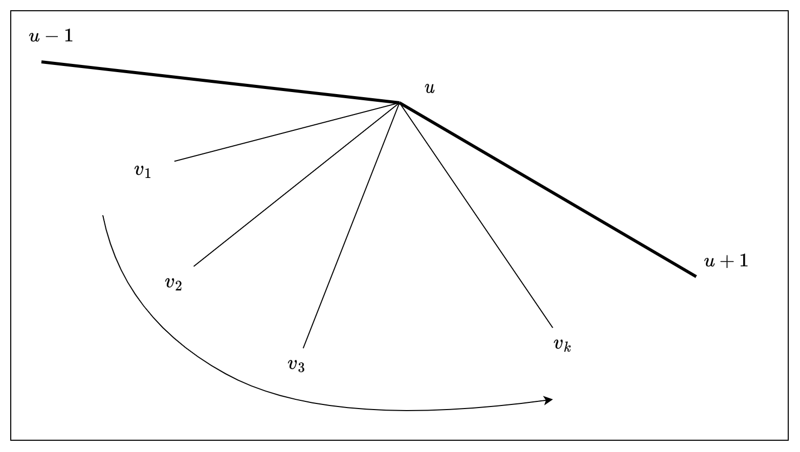

<style>
.visualizer {
    width: 100%;
    height: 800px;
    background: white;
}
</style>

Bài Area Query có thể coi là bài khó nhất trong kì thi ICPC Việt Nam regional 2023 vừa rồi. Đây là bài không có đội nào giải được trong kì thi chính thức (bảng rank xem [tại đây][icpc-vn-2023-regional-ranking]). Đây là một bài khó một phần là vì chủ đề của bài: hình học và cấu trúc dữ liệu. Các bạn có thể đọc đề bài và thử sức trên [VNOJ](https://oj.vnoi.info/problem/icpc23_regional_a).

Tác giả của bài này là anh <cf-handle nickname="chemthan" />, và lời giải của tác giả có sử dụng cấu trúc dữ liệu [link-cut tree][wiki-linkcut-tree]. May mắn là thành viên trong ban ra đề, mình đã được thử sức với bài này trước khi kì thi diễn ra, với thời gian suy nghĩ thoải mái hơn tất cả các thí sinh trong kì thi :innocent:. Nhưng mình chưa bao giờ sử dụng link-cut tree, nên mình đã cố gắng nghĩ ra cách khác không sử dụng đến cấu trúc dữ liệu đó. Và đúng là sau tầm 3 buổi tối, cuối cùng mình cũng đã đưa ra được nhận xét hết sức thú vị để giải quyết bài toán này. Mình muốn chia sẻ quan sát này qua trang blog này.

[icpc-vn-2023-regional-ranking]: https://icpcvn.github.io/2023/regional/scoreboard.html
[wiki-linkcut-tree]: https://en.wikipedia.org/wiki/Link/cut_tree

<!-- more -->

## Quan sát cơ bản

Ù nhưng tại sao bài hình lại sử dụng link-cut tree? Bởi vì có cấu trúc cây xuất hiện khi cắt đa giác thành các đa giác con: nếu như ta coi một đa giác con được cắt ra là một đỉnh, và hai đỉnh có cạnh nối với nhau khi chúng có chung đường chéo (chính là đường cắt cho bởi các truy vấn), ta đồ thị thu được sẽ là một cây.

Đây là quan dễ. Nhưng nếu điều này chưa hiển nhiên đối với bạn thì sau đây là chứng minh của mình:

::: details Chứng minh cấu trúc cây
Ta có thể chứng minh sủ dụng phương pháp quy nạp.

Nhận thấy đa giác không có đường cắt nào đã mãn cấu trúc cây, vì đây là đồ thị gồm một đỉnh.

Bây giờ ta có thể giả thuyết rằng điều này đúng khi ta cắt một đa giác bất kì có số đỉnh nhỏ hơn $n$ thành một số phần, và các đa giác được chia ra thỏa mãn cấu trúc cây. Bây giờ ta sẽ chứng minh điều này đúng với đa giác có $n$ đỉnh.

Ta xét một đường cắt $(u-v)$ bất kì. Đường cắt này sẽ chia đa giác thành hai đa giác con lồi $A$ và $B$. Ta cũng có thể chia các đường cắt còn lại thành $2$ tập: tập đường cắt $X$ chỉ cắt $A$ và tập đường cắt $Y$ chỉ cắt $B$. Không có đường cắt nào sẽ cắt cả $A$ và $B$, vì nếu vậy đường cắt này phải cắt cả $(u-v)$, mâu thuẫn với đề bài.

Sau khi chia ra như vậy, ta có thể thấy tập $X$ sẽ cắt đa giác $A$ thành các vùng tạo thành cấu trúc cây (theo giả thuyết), và tương tự tập $Y$ cũng sẽ cắt đa giác $B$ thành các vùng tạo thành cấu trúc cây.

Bây giờ đường cắt $(u-v)$ chính là cạnh **duy nhất** được thêm vào để nối hai cây lại thành một cây. ĐPCM. 
:::

Dưới đây là ví dụ cho cấu trúc cây khi cắt đa giác với các đường chéo không giao nhau:

<iframe
    class="visualizer"
    frameBorder="0"
    src="https://quangloc99.github.io/vietnam-icpc-2023-regional-areaquery-visualizer/?input=MjAKMCAxMDAKMzEgOTUKNTkgODEKODEgNTkKOTUgMzEKMTAwIDAKOTUgLTMxCjgxIC01OQo1OSAtODEKMzEgLTk1CjAgLTEwMAotMzEgLTk1Ci01OSAtODEKLTgxIC01OQotOTUgLTMxCi0xMDAgLTAKLTk1IDMxCi04MSA1OQotNTkgODEKLTMxIDk1CjYKQSAzIDE4CkEgNCAxNwpBIDQgMTMKQSAxMyAxNwpBIDUgOQpBIDkgMTMK&storedCheckboxes=000&preview-only=1"
/>

::: tip
Ê, bạn thấy đống chữ bên trái của cái hình giống gì không? Đúng rùi, nó có format y như input format của bài Area Query! Và bạn có thể tương tác với hình bằng cách **SỬA** đống chữ đó. Hãy thử copy sample test của bài Area Query (mà không có số `0` đánh dấu kết file) vào thử xem.

::: details Sample input của bài Area Query
```
7
1 1
1 7
2 8
4 7
7 4
8 2
7 1
15
A 1 3
A 1 4
A 1 5
A 1 6
? 1 3
R 1 3
A 2 4
R 1 6
A 5 7
? 2 5
R 1 5
R 1 4
A 4 7
A 2 7
? 7 4
```
:::

Quay trở lại bài toán. Ý tưởng sử dụng link-cut tree thật ra rất tự nhiên cho bài toán, bởi vì khi cắt một phần đa giác thành hai đa giác nhỏ hơn, ta sử dụng thao tác _cut_ của cấu trúc giữ liệu, và khi gộp hai phần đa giác lại, ta sử dụng thao tác _link_. Việc sử dụng link-cut tree ở đây giúp ta duy trì được cấu trúc của cây một cách _rõ ràng_.

Tuy nhiên ta không nhất thiết phải duy trì cây rõ ràng như vậy, mà thật ra các đường cắt đã cho ta cấu trúc của cây một cách ngầm định. Cấu trúc thay thế ở đây là cấu trúc [Euler tour trên cây][wiki-tree-euler-tour].

### Về Euler tour trên cây

Euler tour trên cây, hay còn gọi là trải phẳng trên cây, là cách biến đổi cây thành mảng một chiều, và mảng này được sử dụng để giải quyết bài toán thay vì giải quyết bài toán trực tiếp trên cây.

Chủ đề này đã được trình bày rất chi tiết ở trên [VNOI wiki][vnoi-wiki-tree-euler-tour]. Nhưng mình muốn đề cập đến [bài viết trên Codeforces][cf-tree-euler-tour]. Bài viết trên Codeforces tuy đơn giản nhưng có đề cập đến 3 cách biểu diễn. VNOI wiki cũng có đề cập đến các cách biểu diễn, nhưng chỉ nói trong phần ứng dụng chứ không đặt tên.

Trong bài blog này mình sẽ đề cập dến biểu diễn _loại 2_ và _loại 3_ như bài viết trên Codeforces. Với biểu diễn loại 2, mỗi đỉnh trên cây sẽ nằm trên tour ở hai điểm là $\mathtt{start}_u$ và $\mathtt{stop}_u$. Còn với loại 3, ngoài hai vị trí đầu và cuối, mỗi lần khi đi từ đỉnh con quay lại đỉnh cha, đỉnh cha lại được thêm vào Euler tour.

## Cấu trúc Euler tour của bài Area query

Câu trúc Euler tour thật ra đã được cho bởi các đường cắt!

Giả sử ta đang đứng tại đỉnh $1$ của đa giác đã cho, và ta lần lượt thăm các đỉnh $2, 3, \ldots, n$. Với thứ tự đi như vậy, ta có thể _thăm_ các đường cắt (một đường cắt được thăm khi ta thăm một mút của nó).

Thứ tự thăm các đường cắt như trên cho ta Euler tour của cây!

Dưới đây là một ví dụ đơn giản:

<iframe
    class="visualizer"
    frameBorder="0"
    src="https://quangloc99.github.io/vietnam-icpc-2023-regional-areaquery-visualizer/?input=MTIKMCAxMDAKNTAgODcKODcgNTAKMTAwIDAKODcgLTUwCjUwIC04NwowIC0xMDAKLTUwIC04NwotODcgLTUwCi0xMDAgLTAKLTg3IDUwCi01MCA4Nwo0CkEgMiAxMgpBIDQgMTEKQSA1IDcKQSA4IDEw&storedCheckboxes=110&preview-only=1"
    />

::: tip
Nhắc lại bạn, ở trên không phải là hình tĩnh, mà có thể tương tác được bằng cách sửa lại input ở bên phải  ٩(◕‿◕｡)۶.
:::

Trên hình có ghi lại Euler tour _loại 2_, và các mút của các đường cắt đã thăm theo thứ tự đã nêu trên. Chính xác hơn thì thứ tự thăm đường cắt _gần_ cho ra Euler tour, vì nó không xét đỉnh gốc. Điều này có thể dễ dàng sửa được bằng cách thêm đỉnh gốc vào đầu và đuôi của danh sách. Nhưng điểm đáng chú ý nhất vẫn là thứ tự thăm một đường cắt sẽ cho ta hai thông số $\mathtt{start}_u$ và $\mathtt{stop}_u$ của một  đỉnh $u$ nào đó.

Ù nhưng có gì đó thiểu thiểu không nhỉ? Nếu có nhiều đường cắt có chung mút thì sao? Thật ra ta vẫn có thể sắp xếp được thứ tự thăm của những đường cắt như vậy.  Tỉ dụ ta có các đường cắt $(u, v_1), (u, v_2), \ldots, (u, v_k)$ có mút $u$ chung. Để sắp xếp thứ tự thăm cho các đường cắt này, ta sẽ xét vị trí tương đối của mút còn lại so với $u$. Với đường cắt $(u, v_i)$ thì vị trí tương đối của $v_i$ so với $u$ sẽ là $(v_i - u) \bmod n$. Ta sẽ thăm đường cắt có vị trí tương đối của $v_i$ theo thứ tự **GIẢM DẦN**.

Mô tả ở trên là mô tả chuẩn xác nhưng hơi phức tạp và khó tưởng tượng. Một mô tả ít chuẩn xác nhưng dễ tưởng tượng hơn như sau: xét đỉnh $(u - 1)$ và $(u + 1)$ lần lượt là đỉnh liền trước và liền sau với $u$ trên đa giác. Ta thực hiện _quét xoay vòng_ từ $(u - 1)$ đến $(u + 1)$ với tâm quét là $u$. Thứ tự quét các đường cắt sẽ là thứ tự thăm chúng.



Man nghe vẫn có vẻ phức tạp quá. Để mình lấy luôn ví dụ ở trên.

<iframe
    class="visualizer"
    frameBorder="0"
    src="https://quangloc99.github.io/vietnam-icpc-2023-regional-areaquery-visualizer/?input=MjAKMCAxMDAKMzEgOTUKNTkgODEKODEgNTkKOTUgMzEKMTAwIDAKOTUgLTMxCjgxIC01OQo1OSAtODEKMzEgLTk1CjAgLTEwMAotMzEgLTk1Ci01OSAtODEKLTgxIC01OQotOTUgLTMxCi0xMDAgLTAKLTk1IDMxCi04MSA1OQotNTkgODEKLTMxIDk1CjYKQSAzIDE4CkEgNCAxNwpBIDQgMTMKQSAxMyAxNwpBIDUgOQpBIDkgMTMK&storedCheckboxes=111&preview-only=1"
/>

Nếu nhìn vào thứ tự thăm đường cắt nhưng chỉ liệt kê đỉnh thì có đỉnh được liệt kê lại vài lần, như đỉnh $4$, $13$ hay $9$. Còn nếu ta viết các đường cắt ra thì mọi đường cắt sẽ phân biệt.

Xét đường cắt $(4, 17)$ và $(4, 13)$. $17$ có vị trí tương đổi so với $4$ là $(17 - 4) \bmod 20 = 13$, còn $13$ có vị trí tương đối so với $4$ là $(13 - 4) \bmod 20 = 9$. Như vậy ta sẽ thăm $(4, 17)$ trước.

Xét đường cắt $(13, 9)$, $(13, 4)$ và $(13, 17)$.

- Vị trí tương đối của $9$ so với $13$ là $(9 - 13) \bmod 20 = 16$.
- Vị trí tương đối của $4$ so với $13$ là $(4 - 13) \bmod 20 = 11$.
- Vị trí tương đối của $17$ so với $13$ là $(17 - 13) \bmod 20 = 4$.

Như vậy thứ tự thăm sẽ là $(13, 9)$, $(13, 4)$ và $(13, 17)$.

Khi biểu diễn thứ tự thăm sử dụng đường cắt, ta có hệ quả thú vị: nếu như thứ tự thăm đường cắt $(u, v)$ trùng với $\mathtt{start}_u$, vậy thứ tự thăm đường cắt $(v, u)$ sẽ trùng với $\mathtt{stop}_u$. 

## Finally, lời giải bài toán

Bài toán có yêu cầu thí sinh xử lý truy vấn thêm và xóa đường cắt. Nhưng do đề bài đã đảm bảo rằng tại một thời điểm bất kì, **không có hai cặp đường cắt giao nhau**. Như vậy tại một thời điểm bất kì, thứ tự thăm các đường cắt lúc nào cũng tạo ra một thứ tự Euler tour loại 2 hợp lệ!

Ở đây ta có thể suy nghĩ đến sử dụng Segment tree để duy trì thông tin của cây với Euler tour. Với mỗi đường cắt, ta có thể tìm thứ tự thăm của nó tương đối với tất cả các đường cắt còn lại. Khi một đường cắt $(u, v)$ được thêm vào đa giác, ta có thê tìm vị trí thăm đờng cắt $(u, v)$ và $(v, u)$, rồi cập nhật đoạn trên Segment tree. Cập nhật này sẽ không làm hỏng cấu trúc Euler tour vì lý do đã nêu trên.

Nếu như ta xét toàn bộ $O(n^2)$ đường cắt có thể của đa giác, ta có thể giải quyết bài toán sử dụng cây Segment tree động. Tuy nhiên có những đường cắt ta sẽ không động vào, nên xét hết tất cả sẽ hơi phí phạm. Thay vào đó ta có thể thu gọn lại tập các đường cắt cần xét là các đường xét cho bởi truy vấn, và giờ số đường cắt cần xét là $O(q)$. Vậy ta có thể sắp xếp danh sách đường cắt và thứ tự thăm của đường cắt giờ sẽ là thứ tự của nó trong danh sác đã sắp xếp.

Giả sử ta đang cần giải truy vấn `? x y`. Ta gọi $u$ là đỉnh chứa cạnh $(x, x\bmod n + 1)$, và $v$ là đỉnh chứa cạnh $(y, y \bmod n + 1)$. Đáp án sẽ là:

$$
d(u) + d(v) - 2 \times d(l) + S(l)
$$

trong đó:

- $d(x)$ là tổng diện tích của các vùng trên đường đi từ $x$ lên gốc cây.
- $S(x)$ là diện tích của vùng tương ứng với đỉnh $x$.
- $LCA(u, v)$ là tổ tiên chung gần nhất của $u$ và $v$.

Vì cây của ta được duy trì một cách ngầm định, nên ta không thể làm các thao tác trực tiếp được, ví dụ như tìm cha của một đỉnh. Bây giờ ta sẽ cần phát minh lại một số thao tác trên cây để có thể giải quyết được bài toán gốc.

::: info
Phần dưới là mô tả khá chi tiết, nhưng cũng sẽ hơi phức tạp. Nhưng mình tin rằng với các bạn có đủ kinh nghiệm, những thao tác ở dưới cũng sẽ là cơ bản. Nên mình cũng động viên các bạn sử dụng quan sát chính mô tả ở trên để thu được lời giải của bản thân. :pray:
:::
Nhưng trước hết ta cần quy ước trước:

- Ta gọi đường cắt $(v, u)$ là đường cắt _nghịch đảo_ của đường cắt $(u, v)$.
- Tập hợp $L$ gồm:
  - Các đường cắt đã cho bởi $q$ truy vấn.
  - Các đường cắt _nghịch đảo_ của các đường cắt đã cho bởi $q$ truy vấn.
  - Cạnh đa giác có dạng $(u, u \bmod n + 1)$
  - Cạnh đa giác có dạng $(u \bmod n + 1, u)$.
- $pos_{(u, v)}$ là thứ tự thăm đường cắt $(u, v)$ trong tập $L$ đã được sắp xếp theo thứ tự thăm.
- $\mathtt{start}_{(u, v)} = \min\{ pos_{(u, v)}, pos_{(v, u)} \}$, tương ứng với $\mathtt{start}_u$ với $u$ nào đó ở một thời điểm bất kì.
- $\mathtt{stop}_{(u, v)} = \max\{ pos_{(u, v)}, pos_{(v, u)} \}$, tương ứng với $\mathtt{stop}_u$ với $u$ nào đó ở một thời điểm bất kì.

### Tìm độ sâu của môt đỉnh

Ta có thể sử dụng một cây Segment tree $D$, cho phép tăng đoạn và truy vấn điểm để duy trì thông tin về độ sâu. Khi một đường cắt $(u, v)$ được thêm vào, ta sẽ tăng đoạn $[\mathtt{start}_{(u, v)}, \mathtt{stop}_{(u, v)}]$ lên $1$. Để truy vấn độ sâu của đỉnh tương ứng với vùng chứa đường cắt hoặc cạnh đa giác $(u, v)$, ta truy vấn điểm $\mathtt{start}_{(u, v)}$ trên cây $D$.

### Tìm cha của một đỉnh

Tất nhiên ta không định nghĩa đỉnh trên cây, mà ta chỉ duy trì các khoảng $[\mathtt{start}, \mathtt{stop}]$ của các đỉnh trên cây. Bài toán giờ sẽ là cho cặp số $[l, r]$ thể hiện khoảng của một đỉnh $u$, ta cần tìm khoảng $[p_l, p_r]$ tương ứng với đỉnh $p_u$ trên cây (ở thời điểm hiện tại).

Thao tác có thể giải quyết trong $O(\log^2 n)$. Ta dựng _interval tree_ $P$, với mỗi đỉnh lưu một `set` là các đoạn đã qua khoảng đỉnh này quản lý, và sắp xếp các khoảng theo độ dài.

Khi có update thêm/xóa đoạn cắt $(u, v)$, ta chỉ cần thêm/xóa $[\mathtt{start}_{(u, v)}, \mathtt{stop}_{(u, v)}]$ trên cây $P$. Để tìm đoạn cha tương ứng với $(u, v)$, ta có thể tìm đoạn nhỏ nhất đi qua $\mathtt{start}_{(u, v)}$ mà không phải là $[\mathtt{start}_{(u, v)}, \mathtt{stop}_{(u, v)}]$.

Mình cũng có cách làm thao tác này trong $O(\log n)$, nhưng mình sẽ trình bày sau đoạn này để tiến đến lời giải cuối cùng trước.

### Tìm LCA của hai đỉnh trên cây

Giả sử ta đang cần tìm LCA tương ứng với hai đoạn cắt $(u, v)$ và $(u', v')$.

Ta có thể làm tương tự như tìm cha, tuy nhiên ta làm nó với đoạn $[\min\{ \mathtt{start}_{(u, v)}, \mathtt{start}_{(u', v')} \}, \max\{ \mathtt{stop}_{(u, v)}, \mathtt{stop}_{(u', v')} \}]$, tức đoạn bao phủ cả hai đoạn con. Tổ tiên chung cần tìm sẽ tương ứng với đoạn có độ dài nhỏ nhất bao đoạn này.

### Update diện tích của một vùng

Để làm điều này ta có thể dựng một cây Segment tree $S$, cho phép update điểm, và truy vấn tổng đoán.

Khi thêm đoạn cắt $(u, v)$ vào đa giác ($u < v$), ta cần tính diện tích của hai phần đa giác được cắt ra. Phần được cắt ra thực chất chính là cha của đỉnh tương ứng với $(u, v)$, nên ta sẽ tìm cha $p$ tương ứng với đường cắt này trước trên cây $P$.

Đầu tiên ta tính diện tích của vùng tương ứng với $(u, v)$. Ta có thể tính diện tích $X$ của đa giác gồm các đỉnh $u, u + 1, u + 2, \ldots, v$ (một nửa đa giác cắt bởi $(u, v)$) sử dụng tổng tiền tố. Sau đó ta cần trừ đi diện tích tất cả các con tương ứng với $(u, v)$, nên ta có thể trừ $X$ đi tổng đoạn $[\mathtt{start}_{(u, v)}, \mathtt{stop}_{(u, v)}]$ trên cây $S$ để thu được số $Y$, và đây là diện tích ta cần tìm. Ta sẽ update cây $S$ tại điểm $\mathtt{start}_{(u, v)}$ với giá trị $Y$.

Tiếp đó ta cần update diện tích tương ứng với $p$. Ở đây ta chỉ cần lấy diện tích đang có của $p$ (tại điểm $\mathtt{start}_p$ trên cây $S$), trừ đi $Y$.

Độ phức tạp tổng thể của thao tác này là $O(\log n)$ (không tính việc tìm cha).

Thao tác xóa cũng được làm tương tự nhưng với thứ tự ngược lại.

### Tính tổng diện tích từ một đỉnh lên gốc cây (hàm $d(x)$)

Song song với cây $S$, ta có thể duy trì thêm một cây $S'$ nữa được sử dụng để tính tổng từ một vùng tương ứng với một đỉnh bất kì lên gốc cây.

Mỗi khi điểm $\mathtt{start}_{(u, v)}$ của $S$ được tăng lên $d$, ta cũng sẽ tăng $\mathtt{start}_{(u, v)}$ lên $d$ trên cây $S'$, xong ta sẽ giảm $\mathtt{stop}_{(u, v)}$ trên cây $S'$ đi $d$. Như vậy khi ta muốn truy vấn tổng diện tích từ dỉnh tương ứng với đoạn cắt $(u, v)$ lên gốc cây, ta sẽ tính tổng đoạn $[0, \mathtt{start}_{(u, v)}]$ trên cây $S'$.

Thao tác này cũng tốn $O(\log n)$ thời gian.

## Kết

Cho đến thời điểm hiện tại, mình vẫn thấy quan sát về Euler tour với đường cắt của đa giác này rất là tuyệt vời. Thực sự mà nói những khoảng khắc tìm ra những quan sát như thế này làm mình thấy yêu CP hơn, và rộng hơn thì mình cũng thấy yêu toán và khoa học máy tính hơn, dù mình cũng chỉ là dev quèn. Nhưng dù là dev quèn nhưng mình cũng biết viết blog ahihi. Hi vọng các bạn đọc xong bài này có thể thu lại được gì đó ~~mà không thấy shock~~ 😇.

## Bonus: Tối ưu các thao tác trên cây

Mình sẽ nói đến truy vấn tìm cha. Truy vấn tìm LCA thật ra cũng tương tự, và vì blog này cũng đã quá dài rồi nên là... dành cho 
bạn đọc :sweat_smile:.

Trước khi thực hiện thao tác này, mình cần sửa lại quy ước một chút:

- $pos_{(u, v)}$ giờ sẽ là **hai lần** thứ tự thăm của đường cắt $(u, v)$. Mình muốn nhân $2$ lên để vị trí lẻ tạo ra những khoảng chắn cho giữa hai điểm liên tiếp. Điều này sẽ effectively tạo ra cấu trức Euler tour loại 3.

X_uét đường cắt $(u, v)$ và ta cần tìm khoảng $[p_l, p_r]$ là khoảng tương ứng với cha $p$ của đỉnh $u$ có khoảng $[\mathtt{start}_{(u, v)}, \mathtt{stop}_{(u, v)}]$. Ở đây ta sẽ không dùng cây interval tree $P$ nữa, mà ta sẽ làm mọi thứ trực tiếp trên cây $D$ (cây lưu độ sâu).

Ở đây ta đã biết được độ sâu $d$ là của $u$, do đó ta cũng biết được độ sâu của $p_u$ là $d - 1$. Có thể nhận thấy trước vị trí $p_l$ là điểm $p_l - 1$ được phủ bởi đoạn tương ứng với $p_{p_u}$, và nó sẽ mang giá trị là độ sâu của $p_{p_u}$, tức $d - 2$. Ý tưởng ở đây là thay vì tìm vị trí $p_l$, ta có thể tìm vị trí $p_l - 1$, tức là điể gần $\mathtt{start}_{(u, v)}$ nhất về bên trái mang giá trị $d - 2$.

Để tìm kiếm điểm này ta có thể lợi dụng một tính chất đặt biệt của giá trị trên cây $D$: hai điểm liên tiếp trên cây có giá trị chênh nhau không quá $1$! Nói cách khác, giá trị các điểm là _nguyên liên tục_. Với tính chất này, ta có thể tìm kiếm nhị phân trên cây $D$: khi quyết định đi sang trái hay phải tại một đỉnh trên cây segment trê, nếu như khi đi sang phải mà có min vẫn còn nhỏ hơn, ta sẽ đi sang phải, ngược lại ta sẽ đi sang trái.

Cây $D$ như vậy sẽ chuyển thành cây cho phép update tăng/giảm đoạn và truy vấn _min_ đoạn.

## Bonus: Visualizer

Mình sẽ công nhận là ý tưởng viết visualizer là rất kì công, song cái visualizer mình sẽ treat nó là một cái side project nhỏ. Các bạn có thể sử dụng tính năng đầy đủ của visualizer [tại đây](/demos/icpc-vn-regional-2023-areaquery-visualizer.md).

## Bonus: Validator

Mình cũng là người viết Validator cho bài này. Và kể ra Validator của bài này cũng rất khó vì kiểm tra đoạn mới được thêm vào có giao với các đoạn đã thêm trước đó hay không thật ra không đơn giản. Validator bài này có thể được tách ra làm một bài toán riêng và nó vẫn khó :smiley:.

Validator của mình cũng lợi dụng tính chất Euler tour của đường thăm và cũng sử dụng segment tree. Ở đây nếu như ta thêm đoạn $(u, v)$ và thì điểm $\mathtt{start}_{(u. v)}$ và điểm $\mathtt{start}_{(u, v)}$ cũng cần có cùng tập hợp cha. Bài toán kiểm tra hai tập hợp bằng nhau là một bài toán đã có lời giải, và ở đây mình sử dụng [XOR hash](https://codeforces.com/blog/entry/85900): khi một đoạn được thêm, ta xor đoạn tương ứng với nó bởi một số ngẫu nhiên $x$, và khi đoạn đó được bỏ đi ta lại xor với chính số $x$ đó.

Để tăng sự tự tin thì thay vì mình dùng số 64 bit, mình đã dùng số 256 bit. Về mặt triển khai thì không tốn nhiều công hơn.

[wiki-tree-euler-tour]: https://en.wikipedia.org/wiki/Euler_tour_technique
[cf-tree-euler-tour]: https://codeforces.com/blog/entry/18369
[vnoi-wiki-tree-euler-tour]: https://vnoi.info/wiki/algo/graph-theory/euler-tour-on-tree.mt