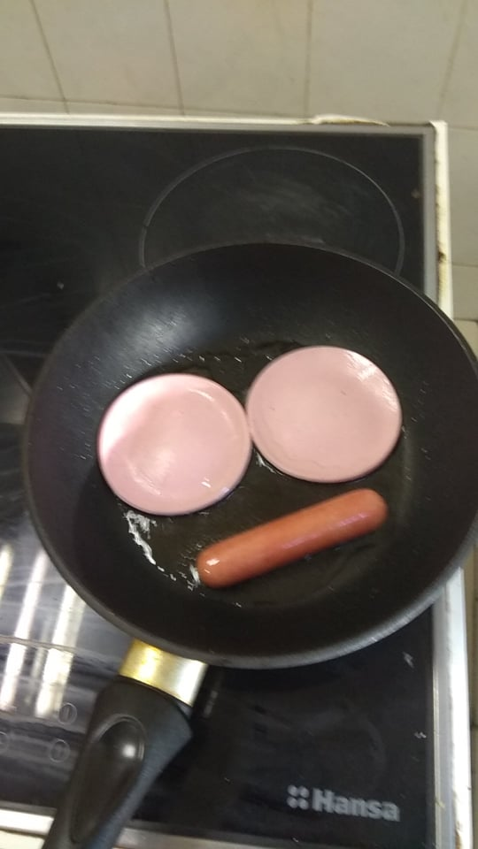
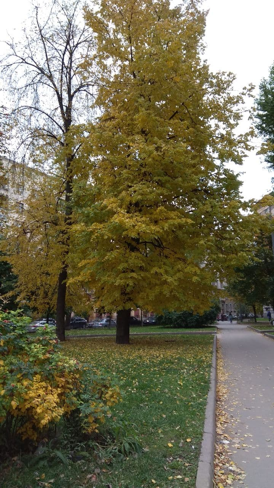
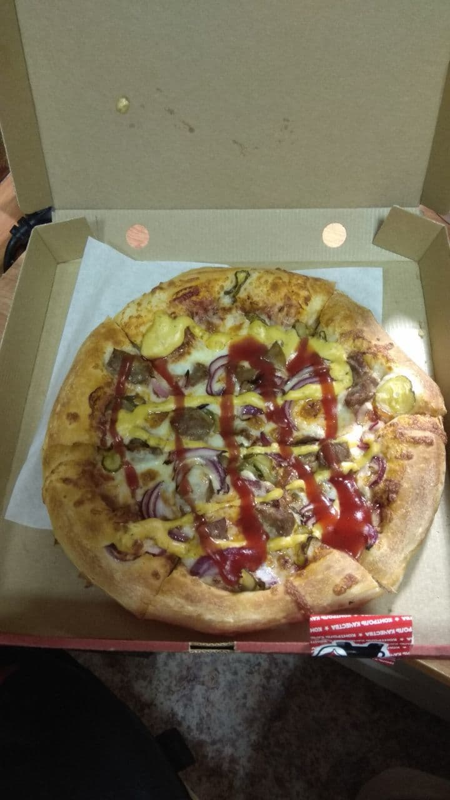

Recently [I][darkkcyan profile] just became a [Grandmaster][Codeforces rating
interpretation](GM) on [Codeforces] (for one who does not know, this is
currently the most popular site for competitive programming). Hoo ray for me! I
guess. Well, I thought that maybe I should do some celebration, sort of. But...
I don't know. Becoming a GM was a _small goal_ of my goals in my competitive
programming career, and for me archiving it after **6 long years** up and down
on the site is a kinda big deal. But somehow I still don't find _satisfaction_
after completing the contest yesterday. Oh well, still an achievement, and I
thought I should mark this moment. So blog writing should works then, as _a way
to celebrate_ and _a way to mark my achievement_. And besides, this blog site is
~~kinda dead~~ tho, this is just another post for making content :). In this
post I will want to talk about... things, randomly, so don't expect something
too crazy (like how to become red).

<!-- more -->

Maybe I'll start telling you how yesterday went, or maybe before that. Well
yesterday (Thursday, September 30Th), I had 2 classes at the university, which
started at 13:30 and 15:20 (Moscow time). And the contest yesterday was
_unusual_ since it started at 13:05 (still in Moscow time) (and the usual ones
often start at 17:35). So I actually have _skipped 1 class_. Please don't be me,
classes are important! And by skipping it, I lose 1 chance to give my lab.  But
why have I done that decision? First of all, it was a lab class (where I have to
do some works, write the report, go show my works, and then defense my work).
The thing is the lab was given to my class (or rather, _my group_) two days
prior.  So if I have planned to do the lab, I have two days. But then I need to
consider this: the class that I skipped is scheduled once in two weeks, while
the next contest on Codeforces _at the time I see the calendar_ will happen in
the next three weeks (and now they added a new one on the next two weeks). But
still, I wanted to compete, and I just don't want to skip this opportunity. I
only have less than a year for the [ICPC]. So the decision was made, and I have
not done that lab at all till the moment of writing this blog :).  Will do it
soon, don't worry! Besides I can give multiple labs at once (for most of the
time).

So how was my day actually went? On the day before, I have decided that I will
sleep for 7 hours. Usually I only sleep for 6 hours or 6 hours 30 minutes. But I
slept _for the contest_ :). I wake up at like 8 o'clock. Usually this is good
**if** I just go brush my teeth, wash my face and have breakfast right away. But
NO, my current self is now on an _unhealthy_ routine: I browse Discord for one
hour, and then do the other thing after.

> I know this should be fixed. But hear me, I have tried today. I just browse the
> message but don't allow myself to reply yet. Therefore I had reason to go
> washing my face :).

Anyway, I made my breakfast, while texting with mom :). Here is my cooking
process tho (these are images I sent mom but I find that it is still suitable
for this post)

After having breakfast (which is about 10 AM btw, because of my unhealthy
routine), I just browsing stuff (which I don't recall). At about 11:30 I
leave for the university. As usual, this is a 2.4km walk for 30-40 minutes. I
bought lunch instead of having lunch at the [_Non-cafeteria_][ITMO cafeteria] at
the university (that is the actual name of the cafeteria btw, which is located
on Kronverksky). I then sat at the [Co-working place][ITMO co-working] of the
university for 1 hour before the contest, just chatting on Discord.

And then there the contest went. If you follow, the contest is somewhat
[unbalanced][Codeforces round #745 downvotes], with Div 1 having a little bit
hard A and more challenging B (and also very easy C). I won't go on the details
on how I tackle the problems, but by today's luck, I have solved those 3 problems,
secured my place for getting red.

But what I have done afterward? I pull out my lunch and eating it while reading
D. At that time I got only more or less 30 minutes. And eating lunch actually
costs a lot of time, and I don't really plan to solve more. After lunch, I just
pack my stuff up and went straight to the lecture (which started at 15:20),
and did not care about the last 10 minutes of the contests.

Sadly I did not take any photo of my lunch, but it was called Шаверма. You can
google this term to see more detail.

Well, that was not the end tho. After my solution passes the system tests (which
happened **after** the end of the contest), that is when I finally relax about
the result. In the lecture, I still cannot concentrate, because again, Discord.
Friends just congratulated me and we discussed the problems. Don't worry I still
listen to most of the lectures tho, even I was more focused on chatting and the
lecture was in Russian :). And I went straight home after the lecture, enjoying
the autumn.

I'm sorry that this is not the best example I can find. But it is most
yellow one on my way to my dormitory. And it was almost night around this
time.

I think that should be the end of the story. In the evening of yesterday, I don't
really do anything special tho, besides preparing for today's lab's protection. I
did not celebrate either. Well, today I thought that I should have done something,
so I just order pizza for myself (I more or less was lazy to cook).

The left is pizza and the right are chickens and some onion rings.

Maybe enough for the story. Now should be the time for the title's question.
What's next? Well, I have ICPC on the way, and I planned to only take part in
ICPC one more time this year, even tho technically I have 2 more changes. I
don't plan on taking a Master's degree yet. Well, I also did really plan anything
at all, I just don't want to continue studying. For the Codeforces part, yeah I
don't really have any plan to stop online competing right now. The result might
not be as good as now tho. I might have chances to go down orange (Master)
again. Or maybe I can reach a higher rank. Who knows? And still, now I only focus
on Codeforces. I do have an orange account on Codechef and an yellow account on
Atcoder. So maybe I might recheck them out, or maybe not because of very strict
time. Speaking about time, I am now a 4th- year student, and I have to do the
final work for my bachelor's degree. Hope that I can still manage to squeeze out
time for doing CP and doing university stuff at the same time. Well, I might just
need to stop lazing around :).

Anyway thanks for reading this random non-structural blog post of mine! Now
re-read it I think it is just like a page of a diary. It should be that tho
because that's all I wanted - mark this day. I do proud of myself for getting
_this_ far tho! I know, there are still lots and lots of people who have a
higher rank than me, and/or can reach GM in a very short time, unlike me with _6
years_ of competing (very sad time indeed :( ). But it still is an achievement to
prove myself worthy!

Thanks again for reading my blog!

##### Side note
Why the language is English? Should the casual stuff be in Vietnamese like I
said in the [first post](../a-blog-pog.md)? For
some reason, I still like writing stuff in English. My mind now is partially
thinking in English. And another reason that this blog _should_ be important. I
want this blog to be as deliverable to many people as it can. And there you have
it, English is the choice to go.

But well that did not go without a cost. I still have to use [Grammarly] to fix
lots of mistakes. And I don't even use the paid version, which offers more
suggestions on the wording. But oh well, good enough, and hope that you guys think
so.

[darkkcyan profile]: https://codeforces.com/profile/darkkcyan
[Codeforces rating interpretation]: https://codeforces.com/blog/entry/68288
[Codeforces]: https://codeforces.com/
[ICPC]: https://en.wikipedia.org/wiki/International_Collegiate_Programming_Contest
[ITMO cafeteria]: https://student.itmo.ru/en/canteen/
[ITMO co-working]: https://student.itmo.ru/en/coworking/
[Codeforces round #745 downvotes]: https://codeforces.com/blog/entry/95478
[Grammarly]: https://app.grammarly.com/

<!-- vim: tw=80 ai nocin spell -->
