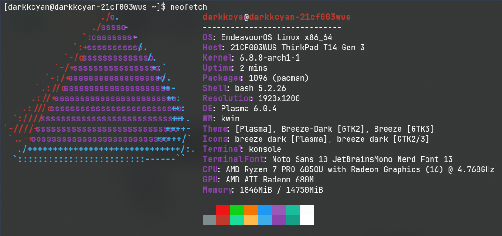

Mua laptop thật ra không khó đến như vậy. Nhưng mình tốn tận **hai tháng** là
vì mình quá tập chung vào một chiếc laptop. Quá trình tìm và đặt mua nó _tại
Việt Nam_ là một quá trình cũng không đơn giản. Và cũng rất buồn là đến cuối
cùng mình đã từ bỏ chiếc laptop đó :sob:. Thay vào đó mình đã mua một chiếc
laptop khác.

Mình khá hài lòng với chiếc laptop mới mua. Nhưng vì blog này tồn tại nên rõ
ràng là hành trình mua laptop cũng là hành trình rất thú vị :wink:. Hi vọng bạn
đọc cũng thưởng thức quá trình mình mua laptop, và mình cũng hi vọng mình cũng chia
sẻ được đôi điều mình học được qua quá trình mua laptop lần thứ x của mình.

<!-- more -->

## Cách mình chọn laptop

**Disclaimer**: Mình không phải là người chọn laptop chuyên nghiệp.

Nhưng chính vì vậy mà mình phải đi nghiên cứu kha khá. Đầu tiên mình _phác
thảo_ ra cấu hình máy tính mà mình muốn mua. Sau đó mình sẽ đi xem review về
chiếc máy đó. Thực ra đây cũng là cách mình mua đồ nói chung, nhưng mua
laptop là một chuyện khác quan trọng hơn là mua đồ lặt vặt :stuck_out_tongue:.

Phần cấu hình máy dưới đây là phần mình research. Nó khá dài và loằng ngoằng.
Các bạn có thể nhảy đến phần tiếp theo nếu không thích xem các chi tiết vừa dài
vừa nhàm.

### Cấu hình máy tính.

Cũng phải nói đây là lần thứ 3+ mình tự đi mua máy tính. Nhưng khác với mọi lần
mình chỉ để ý mỗi RAM và CPU, lần này mình chú ý đến nhiều tham số hơn hẳn. Dưới
đây là các tiêu chí của mình.

#### No Apple

Macbook pro có lẽ là lựa chọn dễ nhất. Thế hệ CPU M1 đến M3 của Apple đến thời
điểm hiện tại vẫn đang là vô địch, kèm theo bề ngoài của Macbook khá bắt mắt.
Tuy nhiên mình vẫn không chọn Apple.

- Mình sử dụng Linux.
- MacOS nói riêng và Apple nói chung là một hệ sinh thái **kín**.

Dù MacOS cũng là Nix, nhưng không nhiều tự do (freedom) như Linux. Mình sử dụng
Linux được 10 năm rồi. Dù không phải pro nhưng khi dùng mình cũng học được rất
nhiều điều. Ngoài ra việc tùy chỉnh Linux cũng rất dễ dàng. Nên mình sẽ không
chọn Apple, ít nhất là thời điểm hiện tại.

Nhưng vì Macbook là một sự lựa chọn tiêu chuẩn, nên mình dùng Macbook làm một
tiêu điểm để chọn laptop.

#### RAM

Mình đã dùng máy tính có RAM 16GB cho công việc của mình, nhưng thi
thoảng vẫn có tool dùng hết RAM, làm cho máy đơ luôn.

Do đó máy mới mình cần ít nhất **32GB RAM**.

Các thông số khác như tốc độ đọc ghi mình cũng không tìm hiểu kĩ trước,
nhưng mình xem kĩ review các máy rồi mình quyết định phần này sau.

#### CPU

Lần này mình học cách đọc tên CPU cẩn thận hơn, dù vẫn noob. Đây là lần thứ n
mình học lại cách đọc tên CPU, rồi sau lại quên luôn :rofl:. Tất nhiên mình cũng
tự đặt ra vài tiêu chí, nhưng cũng như trên, mình sẽ xem máy trước rồi quyết định.

- Intel vs AMD. Đây là hai hãng mà mình biết, và cũng không nên tìm hiểu sâu hơn,
vì search ngoài hai hàng này trên Google cũng rất khó. Mình cũng không tìm hiểu quá
sâu, nhưng dạo vài vòng thì có thấy rằng chip AMD không tốn hiều pin như Intel.
Nên mình sẽ ngả hơn một tí về chọn AMD.
- Brand modifier. Nôm na thì đây chính là `i3`, `i5`, `i7`, và `i9` với Intel.
Với AMD đây là `Ryzen 3`, `Ryzen 5`, `Ryzen 7` và `Ryzen 9`. Mình chắc chắn sẽ không
chọn `3` vì mình hướng tới performance. `5` không phải là lựa chọn tồn nhưng mình sẽ
chọn `7` hoặc `9` nếu có thể.
- Thế hệ chip. Tất nhiên là thế hệ càng mới thì càng tốt rồi. Để đơn giản mình sẽ
khoanh vùng lại hai thế hệ chip gần nhất.
- Hậu tố. Trong tên mỗi chip đều có 1 kí tự cuối để chỉ _sức mạnh_ của chip.
Như `H` thể hiện đây là Chip _**H**igh performance_, còn `U` là _**U**ltra-low
power consuption_. Mình sẽ thiên về chọn performance hơn để làm việc.

Các thông số kĩ thuật hơn như tốc độ xử lý, số lượng core, ... cũng là tùy loại CPU.
Khi chọn mình cũng sẽ so sánh các loại CPU với nhau, rồi cuối cùng mới đưa ra lụa chọn.

#### GPU

Với nhu cầu làm việc của mình thì có GPU luôn là lựa chọn tốt. Song mình cũng
không cần GPU quá mạnh hoặc có tính năng nhật định. Mình không định sử dụng
laptop để chơi game yêu cầu cấu hình cao, cũng như mình cũng không thiết kế đồ
họa, hay làm machine learning. Nên về GPU mình hướng tới lựa chọn tầm trung.

Về tham số cụ thể mình cũng sẽ dựa vào máy tính để quyết định.

#### Tản nhiệt và quạt

Mình cũng không có quá nhiều ý kiến về phần này. Nhưng sau tìm hiểu thì vãn có hai
điểm đối lập sau hiện lên:

- Tiếng ồn quạt. Nếu như ồn quá thì việc dùng máy tính sẽ gây khó chịu. Dù nếu mình
có đeo tai nghe thì nếu như mình phải mang đi làm ở chỗ khác cũng sẽ gây khó chịu cho
mọi người.
> Điểm này làm mình đến lúc mình học đại học. Quạt laptop của mình cũng ồn vừa phải,
tuy nhiên nó lại hay quay liên tục. Nên mình mong muốn tránh phần này.
- Tản nhiệt không tốt thì lại dẫn đến việc _throttling_, ảnh hưởng đến performance.

Về lý tưởng thì mình muốn rằng đa số thời gian mình làm việc bình thường thì sẽ không
nghe thấy quạt, hoặc ít nhất là quạt không bị chú ý đến. Nhưng nếu cần làm công việc
nặng thì máy nên đảm bảo tản nhiệt tốt nhất có thể để công việc vẫn chạy tốt.

#### Pin

Mình không để ý đến phần này trước đây. Nhưng các máy mình dùng trước đây pin
đều không lâu. Do đó đây cũng là phần mình phả chú ý đến khi chọn laptop lần
này.

Mình không tiêu chí mạnh. Đơn giản thif khi xem review thì pin nên càng lâu
càng tốt là ổn.

#### Kích thước và cân nặng

Hai tiếu chí này cũng là hai tiêu chí đối nghịch nhau. Laptop nhỏ nhẹ thì có thể dễ
dàng mang đi, nhưng nhỏ quá sẽ không đủ mạnh. Suy cho cùng máy càng to thì sẽ có
nhiều không gian màn hình hơn, nhiều không gian cho phần cứng hơn, nhưng điều đó
sẽ làm cho máy tính trở nên nặng hơn.

Mình đã dùng laptop có kích thước 14inch và 16inch. Mình thấy rằng cả hai loại
màn hình đều ổn. Do đó mình vẫn sẽ chọn máy có khoảng kích thước từ 14inch đến
16inch. Nhỏ hơn thì quá bé mà lớn hơn thì quá to.

Về cân nặng thì cùng là tùy loại máy. Mình kì vọng máy 16inch sẽ có kích thước
nhỉnh hơn 2kg một chút. Quá nặng thì đúng là mang đi lại sẽ khá cồng kềnh.

Ngoài ra bình thường khi làm việc mình cũng có dùng màn hình ngoài rất to, do
đó không phải lúc nào mình cũng dùng màn hình laptop. Nhưng lựa chọn đúng cũng góp
phần năng trải nghiệm sử dụng, như khi mình đi công tác, hoặc không ngồi làm việc
tại bàn của mình.

#### Màn hình

Lúc này mình tìm hiểu thì giờ mình thấy rằng màn hình cũng rất nhiều điểm chú ý:

- Kích thước. Well phần này mình nói ở trên rồi.
- Độ phân giải (Resolution). Đến thời điểm hiện tại đã có những máy chỉ 16 inch
nhưng có màn với độ phân giải 4K ($3840 \times 2160$). Tất nhiên công việc lập
trình của mình không cần đến độ nét đến như vậy, nên tiêu chí ít nhất là màn
FHD ($1920 \times 1080$), tức là mọi máy hiện tại đều có.
- Tần số quét (Refresh rate). Bây giờ không có màn nào có tần số quét ít hơn
60hz cả. Nhưng khi dùng màn hình ngoài với tần số 165hz, kèm theo điện thoại có
tần số 120hz, giờ mình cảm thấy 60hz lại _quá chậm_ :rofl:. Nên mình sẽ chọn
màn có tần số cao hơn 60hz nếu có thể. Tất nhiên tần số quét cao cũng ảnh hưởng
đến pin, nhưng các màn chắc chắn sẽ hỗ trợ sử dụng tần số quét thấp hơn nếu
cần.
- Độ sáng. Đây cũng là điểm mình ít để ý trước đây. Độ sáng màn được tính bằng nits.
Về cơ bản thì 400 nits sẽ đủ để làm việc ngoài trời. Và mình nhận ra là các máy trước
của mình cũng chưa đến 400 nits :weary:, nên đây cũng là tiêu chí tối thiểu của mình.
- Màu sắc và tương phản. Mình không phải designer (_yet_) nên phần này không
quan trọng lắm.
- Loại hiển thị. Đây chắc là phần cần chú ý nhất. Mình có tìm hiểu được các loại sau:
  + IPS (In-Plane Switching).
  + Mini LED
  + OLED

  Cụ thể các loại hiển thị khác nhau như thế nào chắc mình sẽ không trình bày ở
  đây (phần này dành cho độc giả :rofl:). Nhưng Mini LED và OLED sẽ cho hình
  ảnh sắc nét, tươi và sáng hơn. Màn IPS không như vậy nhưng lại tiết kiệm pin
  hơn. Với các đặc điểm này thì mình sẽ hướng về chọn màn IPS (lại một lần nữa
  mình _chưa_ phải designer).

Welp, bằng một phép màu nào đó mà phần màn hình lại có quá nhiều chi tiết phải
quan tâm. Mình cũng không ngờ sau khi tìm hiểu lại một lần nữa trong lần mua
laptop này.

#### Ngoại hình

Phần này nên là phần ít quan trọng nhất nếu mình chỉ tập chung vào cấu hình.
Song mình có duy nhất 2 tiêu chí nhỏ:
- Laptop không được nhìn quá _hầm hố_. Cụ thể ở đây các dòng Gaming bề ngoài
nhìn bắt mắt nhưng hướng đến game thủ. Mình không thích sự hầm hố như vậy,
again 
- Keyboard layout. Mình rất không thích có phần numpad trên bàn phím của mình.
Mình không bao giờ dùng numpad vì coding không cần sử dụng đến phần đó.

> Macbook có thỏa mãn tiêu chí này :skull:.

#### Giá thành

No hard requirement :rofl:.

### Chiếc máy mình đã sở hữu

Trước đó mình đang sở hữu chiếc máy [Thinkpad T14 gen 3 (AMD)][thinkpad-t14-gen3-amd-psref].

Tại thời điểm mua mình nghĩ chiếc máy này là ngon lắm rồi, nhưng sau khi dùng
được một thời gian (khá ngắn), có một vài điểm chưa ổn lắm về máy.

- Máy mình sử dụng chip AMD Ryzen 7 PRO 6850U. Tuy là chip U nhưng đa số thời gian
mình thấy nó vẫn rất mạnh.
- RAM 16GB. Dung lượng này đáp ứng đc khoảng 70% công việc của mình. Đôi lần mình
sử dụng Vite song song với: browser, Discord và Neovim (có language server) thì
nhiều khi RAM hết sạch!

> Btw RIP [Neofetch] :sob:.

- Thời lượng pin **rất** thấp. Ở đây pin có 39.3Wh. Theo trang [specification][thinkpad-t14-gen3-amd-psref]
thì vẫn có cấu hình với thời lượng pin là 52.5Wh.

- Màn hình là FHD nên không gian làm cũng ổn. Song độ sáng tối đa là 150 nits, nên làm việc
nhiều khi phải tăng độ sáng màn lên. Ngoài ra sau một thời gian dùng mình thấy có dấu hiệu
[image retention][wiki-image-persistence], và màn hình có những vệt đốm mờ. Mình cũng định
đi sửa màn hình thế nào, song có lẽ là nên nâng cấp cả máy luôn.

Đó là các điểm chính mình chưa hài lòng về máy. Về hoạt động bình thường thì
máy vẫn rất ổn. Đặc biệt dù là chip U, song máy chạy rất nhanh, mình chạy code
CP vẫn nhanh gấp đôi Codeforces server :rofl:. Cơ mà mấy điểm trên nó cũng gây
không ít phiền toái khi mình sử dụng. Lý do cũng là vì những tham số trên mình
cũng tìm hiểu chưa kĩ trước khi mua máy. Nên cuối cùng mình cũng quyết định 
mua chiếc mới và lần này là tìm hiểu rất kĩ luôn :+1:.

[thinkpad-t14-gen3-amd-psref]: https://psref.lenovo.com/Product/ThinkPad/ThinkPad_T14_Gen_3_AMD
[Neofetch]: https://github.com/dylanaraps/neofetch
[wiki-image-persistence]: https://en.wikipedia.org/wiki/Image_persistence
